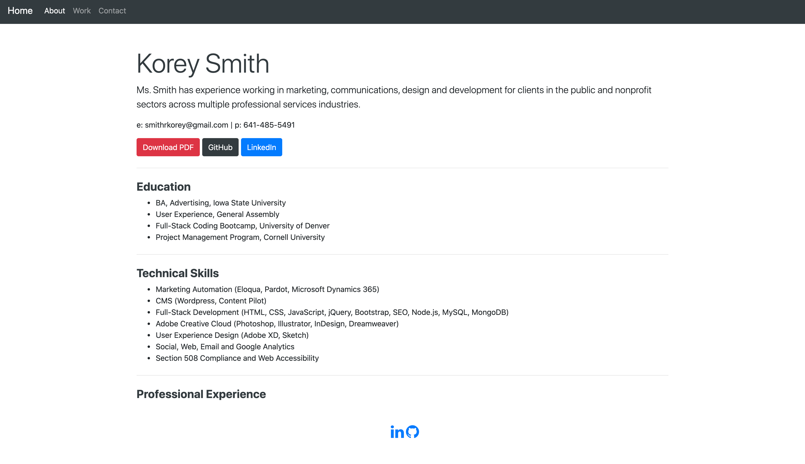

## Portfolio

This project lists my experience and background in UX design and digital marketing. It also showcases my experience as a new developer currently enrolled in a full-stack coding bootcamp at the University of Denver.

## Requirements

* Submit an updated portfolio featuring Project 1 and two exemplary homework assignments. 
* Submit an updated GitHub profile with pinned repositories featuring Project 1 and two exemplary assignments. 
* Submit an updated resume. 
* Submit an updated LinkedIn profile.

## Links

* [Portfolio](https://smithrkorey.github.io/Portfolio/)
* [Github Repository](https://github.com/smithrkorey/Portfolio)

## Mock Up

The following images shows the finished site:

## Contributing Technologies

* [Bootstrap](https://getbootstrap.com/)